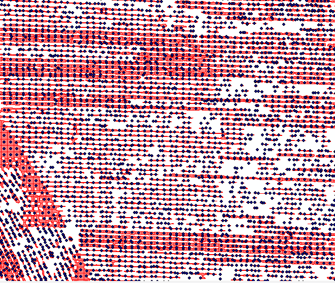

Andrei Kushkin

12/18/2014

Calculating the Number of Pixels per Square Unit from a Binary Raster
Using Self Adjusting Network Generating Algorithm

This Python ArcGIS tool addresses the problem of counting the number of
pixels of a studied entity and turning it into a "pixels per square
unit" heatmap. The algorithm was designed for working with cornfield
images but should be applicable in other scopes too.

**Methods**

The script takes binary raster data as input and produces a heatmap
using the IDW interpolation technique. Pixels of interest should have
integer values of 1, all other pixels should be zeros or "NoData".

First, the input raster is converted to a vector using the *raster to
polygon* tool.

Example of a big polygon highlighted in red.

Next, obtained polygons are split with a regular grid. To do that, a
fishnet must be generated. The cell size of this fishnet is one of the
input parameters of the tool and should be set based on input raster
size and resolution. A one-by-one meter fishnet is generated by default.
The extent of the input raster is automatically considered for
generating intermediate and final data outputs.

Once the fishnet is generated, polygons are cut with *Intersect* tool.
The output might contain multipart polygons and are turned into
single-part polygons using the *Multipart To Singlepart* tool. Then the
polygons that are too small are filtered out to obtain a cleaner result
and reduce the computational load. To do this, *select by attribute* is
applied, using the area field from the attribute table. The threshold
for polygon filtering is another optional parameter of the tool and is
0.1 square meters by default.

The next step is generating centroids of the remaining polygons with the
*Feature to point* tool. These points serve as "centers of gravity" to
which the network is adjusted to follow the distribution of the studied
phenomena.

 | width=500)

Corn point overlaid on polygons cut with a fishnet.

Next, the *Thiessen polygons* tool is applied to the points and that is
how the adjusted network is produced. The screenshot below shows corn
(light blue), corn points or "centers of gravity" (dark blue), and
Thiessen polygons.

Since a grid was used to cut initial corn polygons, Voronoi polygons are
about the same size.

Distribution of Voronoi polygons area

This distribution still shows some variety, which might be reduced by
aggregating points sitting close to each other, or additional processing
of Voronoi polygons (select smallest polygons by area, cut and paste to
a new layer, unite all polygons to a multi polygon, adjacent polygons
should be merged, then explode multi polygons to a group of single
polygons and insert them back to the original Voronoi polygon layer).
This additional processing is not implemented in the current version of
the tool.

To get pixels per area count, the area and number of pixels in each
Thiessen polygon need to be calculated. The number of pixels in each
Thiessen polygon is obtained using the *Zonal statistics* tool. Binary
corn raster and Thiessen polygons are inputs to this tool.

Number of corn pixels in each Thiessen polygon.

A Raster with the area of each Thiessen polygon is generated using the
*Zonal geometry* tool. This tool uses Thiessen polygons as input.
Generated rasters must have the same pixel size, which is done
automatically, by applying the cell size of the initial binary raster.

Area of each polygon

Map algebra (*Raster calculator*) is then used to calculate pixels per
square unit raster. Pixel count raster is simply divided by area raster.

Pixels per square meter in each Thiessen polygon

The last step is producing a heatmap. Pixels per square unit values are
extracted to points *(Extract values to points* tool). The point shape
file generated previously can be used here if there were no changes in
Thiessen polygons. If there were, a new set of points should be
generated (*Feature to point* tool) from the final Thiessen polygons.

The last step is the interpolation of obtained points to a surface.
There are multiple options available in ArcGIS under *Spatial analyst
tools/Interpolation*. At this point, the IDW interpolation is used.

Heatmap. White and red -- more corn, yellow and green less corn.

The code consists of several logic steps: importing modules, setting up
the environment, getting parameters from the tool interface, applying
tools, and clearing memory. The overall logic structure of the code is
sown by the flowchart:

